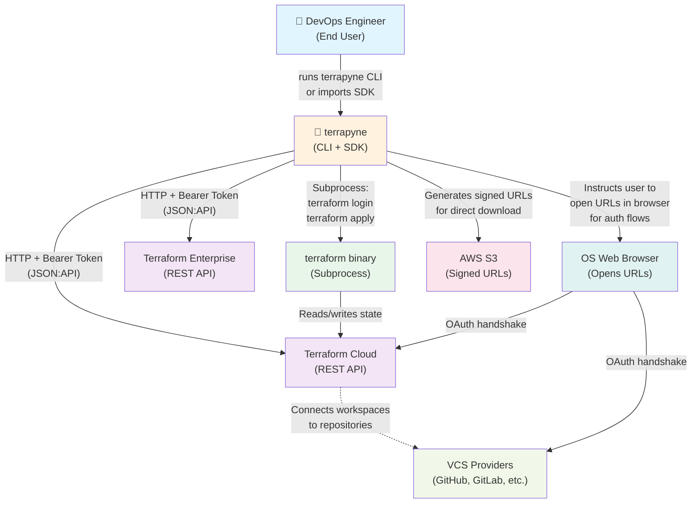

# C4 Level 1: System Context

**terrapyne in relation to the external world**

## Overview

Terrapyne is a Python CLI and SDK for managing Terraform Cloud workspaces, runs, projects, teams, and state versions. This diagram shows terrapyne as a system and the key external actors and systems it interacts with.

## System Context Diagram

## Key Interactions

| Actor/System | How terrapyne uses it | Authentication |
|---|---|---|
| **Terraform Cloud / Enterprise** | Queries workspace state, triggers runs, manages teams and projects | Bearer token in `Authorization` header |
| **terraform binary** | Parses plans, validates syntax, executes `terraform login` for OAuth | Subprocess invocation |
| **AWS S3** | Generates signed URLs for users to download state exports | TFC API provides pre-signed URLs |
| **Web Browser** | Opens for VCS OAuth authorization flows | User-initiated via `typer.confirm()` → `webbrowser.open()` |
| **VCS Providers** | Connected through TFC; terrapyne does not contact directly | TFC manages OAuth tokens |

## Design Notes

- **No direct VCS access**: Terrapyne uses TFC as the VCS gateway. VCS credentials and OAuth tokens are managed by TFC.
- **CLI + SDK split**: The CLI is a consumer of the SDK; both expose the same underlying `TFCClient` and API classes.
- **Local context resolution**: Terrapyne resolves organization and workspace names from environment variables or local Terraform configuration files (`.terraform/terraform.tfstate`, `terraform.tf`) before calling TFC.
- **Subprocess minimization**: The `terraform` binary is used sparingly—mainly for `terraform login` OAuth flows and plan parsing. Most operations use the TFC API directly.
