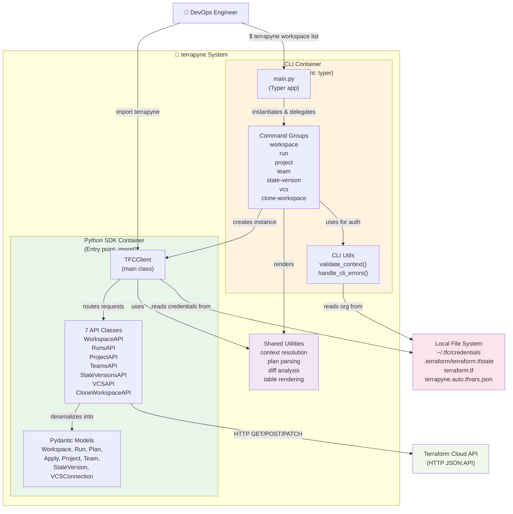

# C4 Level 2: Containers

**CLI vs Library boundary within the terrapyne system**

## Overview

Terrapyne is composed of two containers that share the same codebase but serve different entry points:

1. **CLI Container** — Typer-based command-line interface with 7 sub-command groups
2. **Python SDK Container** — TFCClient and API classes, importable as a Python library

Both containers depend on shared models, utilities, and core logic. Local file system interactions (credentials, state files) are external systems.

## Container Diagram



## Container Responsibilities

### CLI Container

**Scope:** Human-friendly command-line interface

**Responsibilities:**
- Parse command-line arguments (Typer decorators)
- Validate organization/workspace context from flags or environment
- Display output in human-readable format (tables, JSON, plain text)
- Manage interactive confirmations and prompts
- Catch and format errors for end-user clarity

**Key classes:**
- `main.py` — Typer app root with sub-command groups
- `workspace_cmd.py`, `run_cmd.py`, `project_cmd.py`, etc. — Command implementations
- `utils.py` — Context validation, error handling decorators

---

### Python SDK Container

**Scope:** Programmatic access to Terraform Cloud

**Responsibilities:**
- Manage HTTP authentication (Bearer token, retries, exponential backoff)
- Deserialize TFC JSON:API responses into Pydantic models
- Provide high-level methods: `get()`, `list()`, `create()`, `update()`, `delete()`
- Handle pagination internally
- Implement caching for frequently-accessed resources

**Key classes:**
- `TFCClient` — Central client; manages auth, retries, and pagination
- `WorkspaceAPI`, `RunsAPI`, `ProjectAPI`, `TeamsAPI`, `StateVersionsAPI`, `VCSAPI`, `CloneWorkspaceAPI` — Domain-specific API wrappers
- `Workspace`, `Run`, `Plan`, `Apply`, `Project`, `Team`, `StateVersion`, `VCSConnection` — Pydantic response models

---

### Shared Utilities

**Scope:** Common logic used by both containers

**Responsibilities:**
- Resolve organization/workspace from environment, flags, or `.terraform/` context
- Parse and analyze `terraform plan` output
- Render structured data as tables (Rich library)
- Compute diffs between state versions

**Key modules:**
- `utils/context.py` — Organization/workspace resolution
- `utils/terraform_plan_parser.py` — Plan file parsing
- `utils/state_diff.py` — Diff computation
- `utils/rich_tables.py` — Table rendering

---

## Interactions

| Flow | Details |
|---|---|
| **CLI → SDK** | CLI instantiates `TFCClient(organization=...)` and calls API methods. Results are either rendered as tables (default) or serialized to JSON (--format json). |
| **SDK → File System** | SDK reads `~/.tfc/credentials` for API token and organization. Context resolution also reads `.terraform/terraform.tfstate` for workspace context. |
| **CLI → Local FS** | CLI writes artefacts: `terrapyne.auto.tfvars.json` after `clone-workspace` command. |
| **Both → TFC API** | All HTTP requests go through `TFCClient`. Each API class inherits pagination and retry logic. |

---

## Data Flow: `tfc workspace show`

```
User: $ tfc workspace show my-app -o Takeda
  ↓
CLI: validate_context() → resolve from TFC_ORG env + flags
  ↓
CLI: TFCClient(organization="Takeda")
  ↓
CLI: client.workspaces.get("my-app", "Takeda")
  ↓
SDK: TFCClient routes → WorkspaceAPI.get()
  ↓
SDK: Deserialize JSON:API → Workspace model
  ↓
SDK: Return Workspace instance
  ↓
CLI: render_workspace_detail(workspace)
  ↓
User: Formatted table output
```

---

## Data Flow: `tfc run list`

```
User: $ tfc run list -w my-app
  ↓
CLI: resolve workspace → query .terraform/terraform.tfstate
  ↓
CLI: TFCClient.runs.list(workspace_id="ws-abc", include="configuration-version,plan")
  ↓
SDK: Paginate through TFC API, fetch 25 items per page
  ↓
SDK: For each page, deserialize JSON:API → Run model
  ↓
SDK: Enrich Run with commit info from configuration-version includes
  ↓
CLI: Collect all Run instances
  ↓
CLI: render_run_list(runs)
  ↓
User: Formatted table output
```
