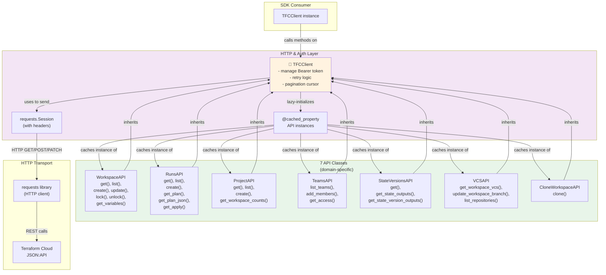
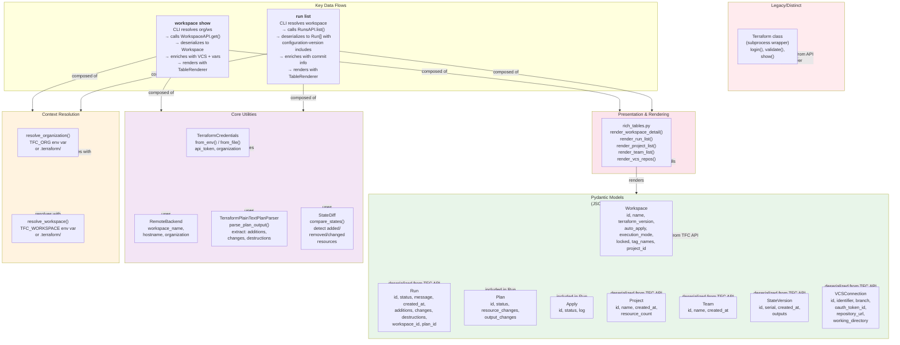

# C4 Level 3: Components

**Detailed view of two focused sub-systems: API Layer and Models/Core/Context**

## Overview

This level breaks down the SDK and shared utilities into fine-grained components:

1. **API & Transport Layer** — HTTP client, 7 API classes, retry/pagination logic
2. **Models, Core Utilities & Context** — Pydantic models, parsing, diff, context resolution

Two separate diagrams for clarity; together they show the complete internal structure.

---

## Sub-diagram A: API & Transport Layer



### API Class Responsibilities

| Class | Primary Operations | Key Methods |
|---|---|---|
| **WorkspaceAPI** | Create, read, list, update, lock/unlock workspaces | `get()`, `list()`, `create()`, `update()`, `lock()`, `unlock()`, `get_variables()` |
| **RunsAPI** | Query runs, download plans and applies | `get()`, `list()`, `create()`, `get_plan()`, `get_plan_json()`, `get_apply()` |
| **ProjectAPI** | Manage projects, count workspaces per project | `get()`, `list()`, `create()`, `get_workspace_counts()` |
| **TeamsAPI** | Query teams, manage team membership and access | `list_teams()`, `add_members()`, `get_access()` |
| **StateVersionsAPI** | Retrieve and analyze state versions | `get()`, `get_state_outputs()`, `get_state_version_outputs()` |
| **VCSAPI** | Query and update VCS connections | `get_workspace_vcs()`, `update_workspace_branch()`, `list_repositories()` |
| **CloneWorkspaceAPI** | Clone workspace state and variables to new workspace | `clone()` |

---

## Sub-diagram B: Models, Core & Context



### Model Serialization

All Pydantic models follow the same deserialization pattern:

```python
@classmethod
def from_api_response(cls, data: dict, included: dict | None = None):
    """Deserialize JSON:API response into model instance."""
    # Extract attributes
    attrs = data.get("attributes", {})
    # Extract relationships and optional includes
    return cls(
        id=data["id"],
        **attrs,
        **enriched_from_includes,
    )
```

This allows models to:
- Extract nested data from `included` array (e.g., commit info from `configuration-version`)
- Gracefully handle missing includes (fields remain None)
- Support dynamic enrichment without schema changes

### Core Utilities

| Utility | Purpose | Key Methods |
|---|---|---|
| **TerraformCredentials** | Read/write local TFC credentials file | `from_env()`, `from_file()`, `save()` |
| **RemoteBackend** | Parse `terraform { cloud { ... } }` block | Constructor from block dict |
| **TerraformPlainTextPlanParser** | Extract stats from `terraform show -json` | `parse_plan_output()` |
| **StateDiff** | Compare state versions, identify changes | `compare_states()` |

### Context Resolution

Two functions in `utils/context.py`:

| Function | Purpose | Sources (in order) |
|---|---|---|
| **resolve_organization()** | Find organization name | 1. CLI flag (`-o`) 2. `TFC_ORG` env var 3. `.terraform/terraform.tfstate` |
| **resolve_workspace()** | Find workspace name | 1. CLI flag (`-w`) 2. `TFC_WORKSPACE` env var 3. `.terraform/terraform.tfstate` |

### Presentation Layer

`rich_tables.py` provides rendering functions for each entity:

| Function | Input | Output |
|---|---|---|
| `render_workspace_detail()` | Workspace + variables + VCS | Rich table with fields and values |
| `render_run_list()` | Run[] | Rich table with id, status, message, stats |
| `render_project_list()` | Project[] | Rich table with id, name, resource count |
| `render_team_list()` | Team[] | Rich table with id, name, created_at |
| `render_vcs_repos()` | dict[] | Rich table with identifier, workspace count |

---

## Design Patterns

### Lazy Initialization

API classes are cached as properties on `TFCClient`:

```python
class TFCClient:
    @cached_property
    def workspaces(self) -> WorkspaceAPI:
        return WorkspaceAPI(self)
```

Benefits:
- Single instance per client
- Shared session and retry logic
- Reduced memory footprint

### Model Enrichment at Construction

Run model accepts optional `included` parameter:

```python
run = Run.from_api_response(
    data={"id": "run-abc", "attributes": {...}},
    included=[
        {"type": "configuration-version", "id": "cv-123", "attributes": {"commit": {...}}}
    ]
)
```

This allows:
- Hydration of related data without separate API calls
- Graceful degradation if includes are missing
- Centralized enrichment logic

### Pagination Transparency

Each API method handles pagination internally:

```python
# CLI calls once
for run in client.runs.list(workspace_id="ws-abc"):
    print(run.id)

# Internally: fetch pages, decode cursors, iterate all results
```

---

## Legacy: Terraform Class

The `Terraform` class (subprocess wrapper) exists but is **distinct** from the API layer:

- **Use case:** Local `terraform` commands that don't route through TFC API
- **Examples:** `terraform login`, `terraform validate`, `terraform show`
- **Not recommended for:** Workspace queries or state management (use SDK instead)

This is kept separate to emphasize that the primary data path is the TFC API, not subprocess invocation.
