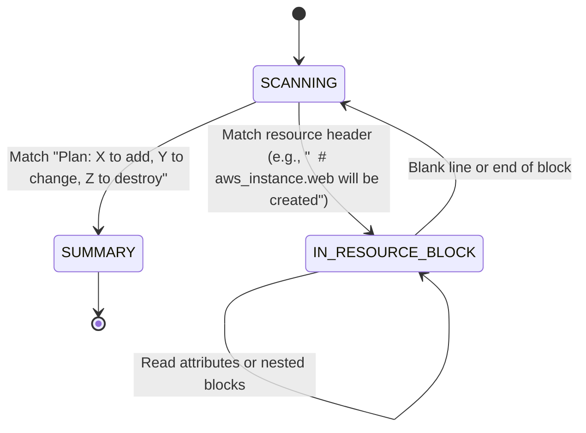

# ADR-005: Plan Parser Analysis

**Date:** 2026-05-21  
**Status:** Accepted  
**Relates to:** core/plan_parser  

The `PlanParser` is a conceptual component of Terrapyne designed to bridge the gap between unstructured terminal output and structured program execution. It extracts machine-readable states from raw CLI plan logs.

## Conceptual Background

When Terraform runs in a remote-execution environment like Terraform Cloud (TFC) or Terraform Enterprise (TFE), it streams its execution output as plain-text terminal logs. Because TFC streams this standard output to developers and CI pipelines, the output is optimized for human readability rather than automated ingestion:
1. It contains ANSI escape codes for styling and colors.
2. It uses visual indentation (spacing, `+`, `-`, `~`) to denote actions.
3. It does not provide a native machine-readable API payload (like JSON plan files) during execution stream follow.

To automate policies or inspect changes programmatically before apply, Terrapyne must parse this unstructured raw log.

## Why a State Machine?

A simple line-by-line regex match is insufficient to parse Terraform plan logs because the context of a line depends on the lines preceding it. For example, a line containing an attribute change (`+ name = "my-db"`) only makes sense if we know which resource block it belongs to.

To resolve this, the plan parser is implemented as a **deterministic state machine** with the following logical states:

### State Transitions & Mechanics

1. **`SCANNING`**: The default state. The parser discards general terminal logs, VCS information, and CLI warnings, searching for a resource change marker (e.g., lines starting with `  #` or `#`).
2. **`IN_RESOURCE_BLOCK`**: Once a resource header is matched (such as `# null_resource.test will be created`), the parser transitions here. It tracks the current resource name, type, and path. Subsequent lines are parsed to extract attribute changes until a blank line or a new block header transitions it out.
3. **`SUMMARY`**: The parser searches for the final "Plan:" or "No changes." summary line to determine the global action counts.

## Parsing Challenges & Design Decisions

### 1. ANSI Color Code Stripping
Terraform streams styled output containing ANSI Escape Sequences (e.g., `\u001b[0m`). These sequences fragment strings and break standard regular expressions.
- *Decision*: The parser applies a preprocessing regex filter to sanitize the text stream, stripping all styling escape codes before feeding lines to the state machine.

### 2. Provider-Specific Diff Formats
Different Terraform providers and resource schemas can produce nested structures, map lookups, or block lists in the diff.
- *Decision*: Rather than attempting full schema validation, the parser focuses on extracting the action (`create`, `update`, `destroy`, `read`, `noop`) and the resource coordinates (type, name, provider, module path) by matching known line patterns.

### 3. Human-Readable Summaries vs. Rigid Patterns
The exact phrasing of the summary line changes across major Terraform versions (e.g., introducing "import" counts in newer versions).
- *Decision*: The parser uses flexible regular expressions that look for combinations of action verbs (add, change, destroy, import) alongside digits, fallback-matching if certain counts are absent.

